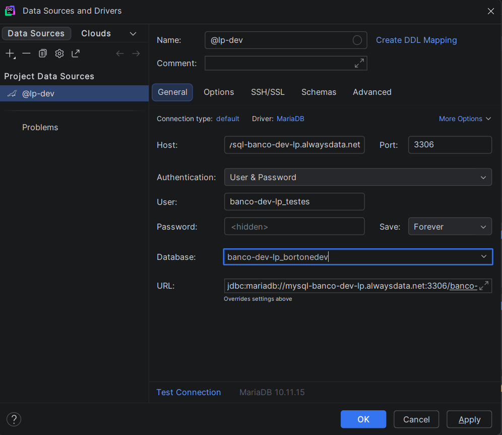

# Documentação de Banco de Dados

## Visualização do Banco de Dados:
- [Arquivo de modelagem](documentacao/docs/assets/diagrama_banco.md)

---

# Para os desenvolvedores: 
## Conectividade e Diferenciação de Ambientes

Antes de iniciar qualquer modificação, é fundamental entender onde você está conectado e as permissões de cada ambiente para evitar incidentes.

### 1. Banco Local (Docker)
* **Finalidade:** Ambiente isolado para desenvolvimento e testes de estrutura.
* **Conexão:** Geralmente via `localhost:3306` (conforme configurado no `compose.yml`).
* **Privilégios:** **Totais**. Você tem permissão para criar, alterar e deletar tabelas.
* **Diferença Técnica:** Roda na engine **MySQL 8.0**.

### 2. Banco de Desenvolvimento (AlwaysData)
* **Finalidade:** Ambiente compartilhado para integração de código e testes com massa de dados.
* **Conexão:** Host remoto do AlwaysData (ex: `@banco_dev`).
* **Restrições Rígidas:** * **Proibido:** Realizar alterações estruturais (DDL) manualmente ou via `migrate dev`. O esquema é alterado apenas via pipeline automática após aprovação.
    * **Permitido:** Apenas testes de criação e manipulação de dados (DML - `INSERT`, `UPDATE`, `SELECT`).
* **Diferença Técnica:** Roda na engine **MariaDB 10.11**.


## Fluxo de desenvolvimento:
### 1. Conecte-se ao banco de dados:
- Se for realizar testes de criação de dados ou de consulta (seja por meio do SQL ou via a API), utilize o banco de desenvolvimento `AlwaysData`. As credenciais de acesso estão disponíves com seu PM/PO
- Se for realizar testes que necessitem de mudanças nas tabelas (para futuramente solicitar a mudança ao time de BD) utilize o banco local em `docker`

Para se conectar ao banco, utilize uma ferramenta de banco de dados como o `HeidiSQL`, `DataGrip`, `dBeaver` ou `MySQL Workbench`

Dentro da ferramenta, crie uma nova conexão e insira as credenciais do banco irá utilizar:


### 2. Realize os testes
Com os testes devidamente realizados, altere os dados de conexão no arquivo `.env` do projeto:
```
# BANCO LOCAL (DEVE SER CRIADO USANDO O COMPOSE DO REPOSITORIO DATABASE) NÃO PRECISA DE ALTERAÇÃO

#DATABASE_HOST=localhost
#DATABASE_USERNAME=root
#DATABASE_PASSWORD=rootpassword
#DATABASE_DB=app_db
#DATABASE_PORT=3306

# BANCO DE DESENVOLVIMENTO

DATABASE_HOST=mysql-banco-dev-lp.alwaysdata.net

# ADICIONE AS CREDENCIAIS
DATABASE_USERNAME=USERNAME
DATABASE_PASSWORD=SENHA

DATABASE_DB=banco-dev-lp_bortonedev
DATABASE_PORT=3306


```


## Regras de Governança

> **Qualquer mudança necessária deve ser obrigatoriamente testada no banco LOCAL primeiro.**
> 
> Após a validação local, a alteração deve ser solicitada à equipe de Banco de Dados via **Issue** para aprovação. O banco de desenvolvimento nunca deve ser alterado estruturalmente por usuários comuns.

---

# Guia de Modificação do Banco de Dados com Migrations (obs: utilizado somente pela equipe de Database)

## Informações sobre o Banco

### 1. Versão do banco:
- O banco de dados local (feito via docker compose) roda na engine `mysql:8.0`
- O banco de dados de desenvolvimento (hospedado no AwaysData) roda na engine `mariadb:10.11`

### 2. Gerenciamento do banco:
- O gerenciamento do banco é feito usando `migrations` (que funciona como um versionamento). As migrations são criadas usando o `PrismaORM`

## Fluxo de Processo

### 1. Setup Inicial

```bash
# Clone o projeto
git clone https://github.com/laboratorio-de-praticas-2026-1/database.git
cd <project-directory>

# Inicie os serviços
docker-compose -f compose.yml up -d

# Configure variáveis de ambiente
cp .env.example .env
# ou configure manualmente com conexão local
```

### 2. Modificar Schema

Edite `schema.prisma` conforme necessário:

```prisma
model User {
  id    Int     @id @default(autoincrement())
  email String  @unique
  name  String
  // nova coluna:
  cpf   String  @unique
}
```

### 3. Gerar Migration

```bash
npx prisma migrate dev --create-only
```

**Analise** os arquivos `.sql` gerados em `prisma/migrations/` antes de executar.

### 4. Executar Migration Local

```bash
npx prisma migrate dev
```

Teste e valide que nenhuma funcionalidade foi quebrada.

### 5. Submeter para Revisão

- Abra um PR para `develop`
- Após merge, a pipeline automática executa:
  ```bash
  npx prisma migrate deploy
  ```
  no ambiente de desenvolvimento

### 6. Deploy para Produção

Após merge em `main`, a mesma migration é automaticamente executada no ambiente de produção.
