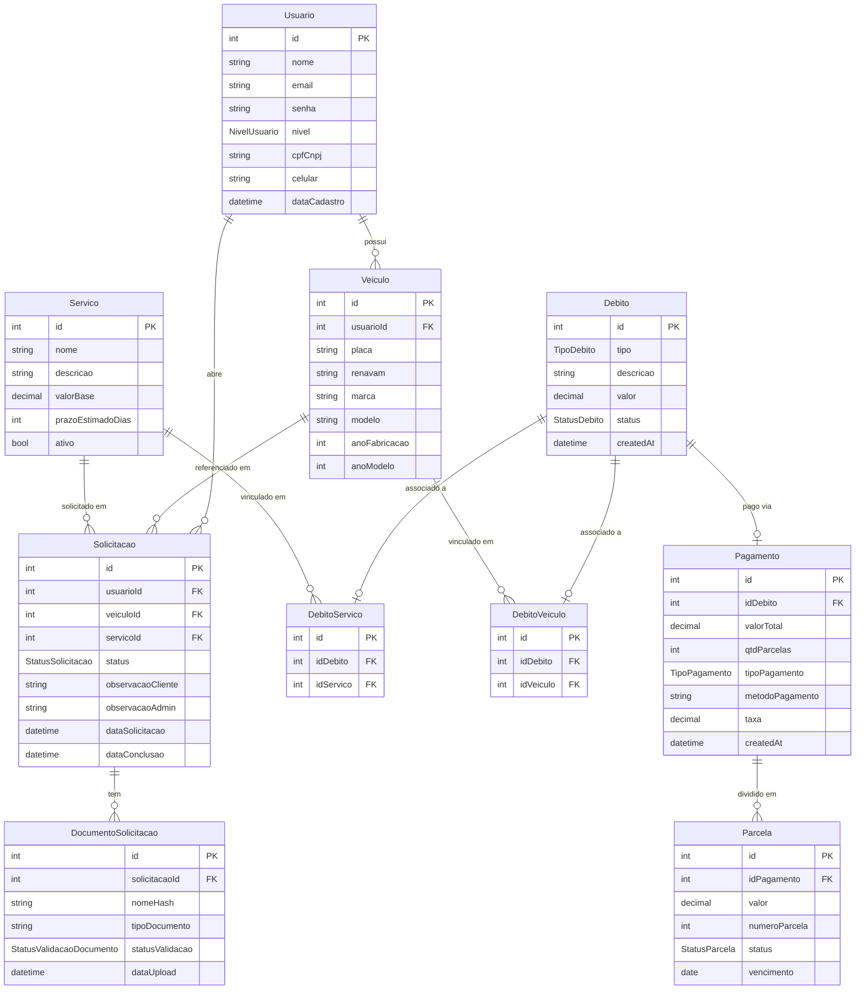

```mermaid
erDiagram
    Usuario {
    int id PK
    string nome
    string email
    string senha
    NivelUsuario nivel
    string cpfCnpj
    string celular
    datetime dataCadastro
    }
    Veiculo {
    int id PK
    int usuarioId FK
    string placa
    string renavam
    string marca
    string modelo
    int anoFabricacao
    int anoModelo
    }
    Solicitacao {
    int id PK
    int usuarioId FK
    int veiculoId FK
    int servicoId FK
    StatusSolicitacao status
    string observacaoCliente
    string observacaoAdmin
    datetime dataSolicitacao
    datetime dataConclusao
    }
    Servico {
    int id PK
    string nome
    string descricao
    decimal valorBase
    int prazoEstimadoDias
    bool ativo
    }
    DocumentoSolicitacao {
    int id PK
    int solicitacaoId FK
    string nomeHash
    string tipoDocumento
    StatusValidacaoDocumento statusValidacao
    datetime dataUpload
    }
    Debito {
    int id PK
    TipoDebito tipo
    string descricao
    decimal valor
    StatusDebito status
    datetime createdAt
    }
    DebitoServico {
    int id PK
    int idDebito FK
    int idServico FK
    }
    DebitoVeiculo {
    int id PK
    int idDebito FK
    int idVeiculo FK
    }
    Pagamento {
    int id PK
    int idDebito FK
    decimal valorTotal
    int qtdParcelas
    TipoPagamento tipoPagamento
    string metodoPagamento
    decimal taxa
    datetime createdAt
    }
    Parcela {
    int id PK
    int idPagamento FK
    decimal valor
    int numeroParcela
    StatusParcela status
    date vencimento
    }
    
    Usuario ||--o{ Veiculo : "possui"
    Usuario ||--o{ Solicitacao : "abre"
    Veiculo ||--o{ Solicitacao : "referenciado em"
    Servico ||--o{ Solicitacao : "solicitado em"
    Solicitacao ||--o{ DocumentoSolicitacao : "tem"
    Debito ||--o| DebitoServico : "associado a"
    Debito ||--o| DebitoVeiculo : "associado a"
    Servico ||--o{ DebitoServico : "vinculado em"
    Veiculo ||--o{ DebitoVeiculo : "vinculado em"
    Debito ||--o| Pagamento : "pago via"
    Pagamento ||--o{ Parcela : "dividido em"
```
