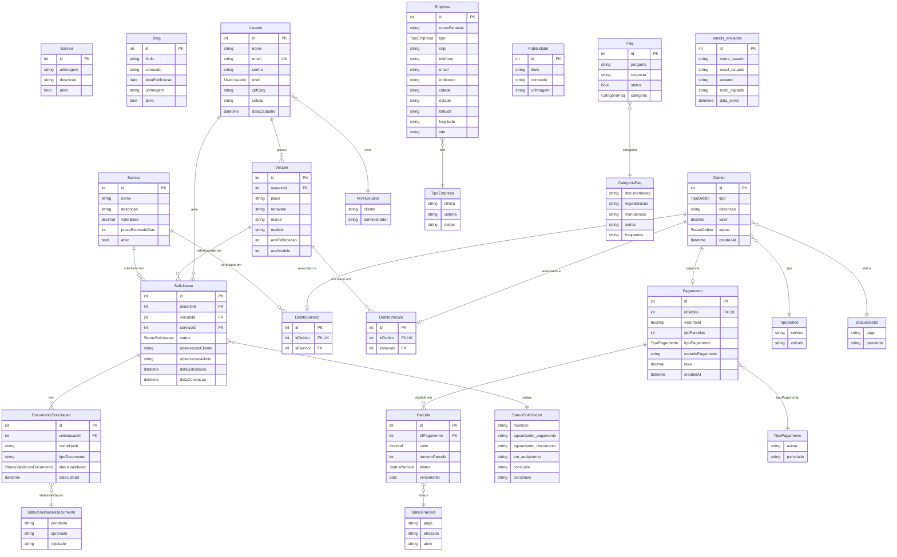

```mermaid
erDiagram
    Banner {
        int id PK
        string urlImagem
        string descricao
        bool ativo
    }
    Blog {
        int id PK
        string titulo
        string conteudo
        date dataPublicacao
        string urlImagem
        bool ativo
    }
    Empresa {
        int id PK
        string nomeFantasia
        TipoEmpresa tipo
        string cnpj
        string telefone
        string email
        string endereco
        string cidade
        string estado
        string latitude
        string longitude
        string site
    }
    Faq {
        int id PK
        string pergunta
        string resposta
        bool status
        CategoriaFaq categoria
    }
    Publicidade {
        int id PK
        string titulo
        string conteudo
        string urlImagem
    }
    Usuario {
        int id PK
        string nome
        string email UK
        string senha
        NivelUsuario nivel
        string cpfCnpj
        string celular
        datetime dataCadastro
    }
    Veiculo {
        int id PK
        int usuarioId FK
        string placa
        string renavam
        string marca
        string modelo
        int anoFabricacao
        int anoModelo
    }
    Solicitacao {
        int id PK
        int usuarioId FK
        int veiculoId FK
        int servicoId FK
        StatusSolicitacao status
        string observacaoCliente
        string observacaoAdmin
        datetime dataSolicitacao
        datetime dataConclusao
    }
    Servico {
        int id PK
        string nome
        string descricao
        decimal valorBase
        int prazoEstimadoDias
        bool ativo
    }
    DocumentoSolicitacao {
        int id PK
        int solicitacaoId FK
        string nomeHash
        string tipoDocumento
        StatusValidacaoDocumento statusValidacao
        datetime dataUpload
    }
    emails_enviados {
        int id PK
        string nome_usuario
        string email_usuario
        string assunto
        string texto_digitado
        datetime data_envio
    }
    Debito {
        int id PK
        TipoDebito tipo
        string descricao
        decimal valor
        StatusDebito status
        datetime createdAt
    }
    DebitoServico {
        int id PK
        int idDebito FK, UK
        int idServico FK
    }
    DebitoVeiculo {
        int id PK
        int idDebito FK, UK
        int idVeiculo FK
    }
    Pagamento {
        int id PK
        int idDebito FK, UK
        decimal valorTotal
        int qtdParcelas
        TipoPagamento tipoPagamento
        string metodoPagamento
        decimal taxa
        datetime createdAt
    }
    Parcela {
        int id PK
        int idPagamento FK
        decimal valor
        int numeroParcela
        StatusParcela status
        date vencimento
    }

    NivelUsuario {
        string cliente
        string administrador
    }
    StatusSolicitacao {
        string recebido
        string aguardando_pagamento
        string aguardando_documento
        string em_andamento
        string concluido
        string cancelado
    }
    StatusValidacaoDocumento {
        string pendente
        string aprovado
        string rejeitado
    }
    TipoEmpresa {
        string clinica
        string vistoria
        string detran
    }
    CategoriaFaq {
        string documentacao
        string regularizacao
        string manutencao
        string outros
        string frequentes
    }
    TipoDebito {
        string servico
        string veiculo
    }
    StatusDebito {
        string pago
        string pendente
    }
    TipoPagamento {
        string avista
        string parcelado
    }
    StatusParcela {
        string pago
        string atrasado
        string ativo
    }

    Usuario ||--o{ Veiculo : "possui"
    Usuario ||--o{ Solicitacao : "abre"
    Veiculo ||--o{ Solicitacao : "referenciado em"
    Servico ||--o{ Solicitacao : "solicitado em"
    Solicitacao ||--o{ DocumentoSolicitacao : "tem"
    Debito ||--o| DebitoServico : "associado a"
    Debito ||--o| DebitoVeiculo : "associado a"
    Servico ||--o{ DebitoServico : "vinculado em"
    Veiculo ||--o{ DebitoVeiculo : "vinculado em"
    Debito ||--o| Pagamento : "pago via"
    Pagamento ||--o{ Parcela : "dividido em"

    Usuario }o--|| NivelUsuario : "nivel"
    Solicitacao }o--|| StatusSolicitacao : "status"
    DocumentoSolicitacao }o--|| StatusValidacaoDocumento : "statusValidacao"
    Empresa }o--|| TipoEmpresa : "tipo"
    Faq }o--|| CategoriaFaq : "categoria"
    Debito }o--|| TipoDebito : "tipo"
    Debito }o--|| StatusDebito : "status"
    Pagamento }o--|| TipoPagamento : "tipoPagamento"
    Parcela }o--|| StatusParcela : "status"
```
