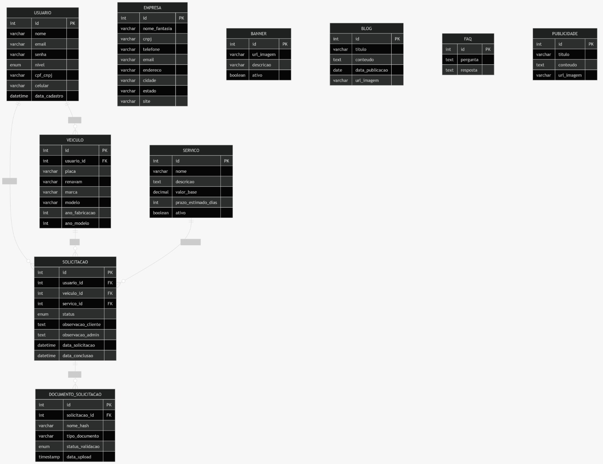

# Modelagem do Banco de Dados

O banco de dados do **Despachante Bortone** é estruturado para suportar o fluxo completo de um escritório de despachante: desde o cadastro de clientes e seus veículos, passando pelos serviços disponíveis, até o ciclo de vida de uma solicitação com seus respectivos documentos.

---

## Diagrama

### Modelo original do banco:


### Modelo atual do banco:
[Arquivo de modelagem](assets/diagrama_banco.md)

---

## Enumerações (ENUMs)

### `NivelUsuario`

Define o nível de acesso de um usuário no sistema.

| Valor           | Descrição                                                                                 |
| --------------- | ----------------------------------------------------------------------------------------- |
| `cliente`       | Usuário padrão. Pode abrir solicitações e acompanhar seus processos.                      |
| `administrador` | Usuário com acesso total. Gerencia solicitações, documentos, serviços e conteúdo do site. |

---

### `StatusSolicitacao`

Representa o ciclo de vida de uma solicitação de serviço.

| Valor                  | Descrição                                                   |
| ---------------------- | ----------------------------------------------------------- |
| `recebido`             | Solicitação foi criada pelo cliente e aguarda análise.      |
| `aguardando_pagamento` | Aguardando confirmação de pagamento pelo cliente.           |
| `aguardando_documento` | Aguardando envio de documento pelo cliente.                 |
| `em_andamento`         | A solicitação está sendo processada pelo despachante.       |
| `concluido`            | Serviço finalizado com sucesso.                             |
| `cancelado`            | Solicitação cancelada (pelo cliente ou pelo administrador). |

---

### `StatusValidacaoDocumento`

Descreve o estado de validação de um documento enviado.

| Valor       | Descrição                                                        |
| ----------- | ---------------------------------------------------------------- |
| `pendente`  | Documento enviado, mas ainda não analisado pelo administrador.   |
| `aprovado`  | Documento validado e aceito.                                     |
| `rejeitado` | Documento recusado (formato inválido, ilegível, incorreto etc.). |

---

## Tabelas

### `banner`

Armazena os banners exibidos no site institucional.

??? note "Colunas"

    | Coluna | Tipo | Descrição |
    |---|---|---|
    | `id` | INT (PK, auto) | Identificador único do banner. |
    | `url_imagem` | VARCHAR | URL da imagem do banner. |
    | `descricao` | VARCHAR | Texto descritivo ou legenda do banner. |
    | `ativo` | BOOLEAN | Indica se o banner está ativo e deve ser exibido. Padrão: `true`. |

_Tabela de conteúdo gerenciado pelo administrador para exibição no frontend._

---

### `blog`

Armazena as postagens do blog institucional do despachante.

??? note "Colunas"

    | Coluna | Tipo | Descrição |
    |---|---|---|
    | `id` | INT (PK, auto) | Identificador único do post. |
    | `titulo` | VARCHAR(150) | Título do post. |
    | `conteudo` | TEXT | Conteúdo completo do post. |
    | `data_publicacao` | DATE | Data de publicação do post. |
    | `url_imagem` | VARCHAR | URL da imagem de capa do post. |

_Tabela para posts informativos sobre serviços, datas e novidades do setor._

---

### `empresa`

Armazena os dados cadastrais da empresa (Despachante Bortone). Prevista para ter somente um registro.

??? note "Colunas"

    | Coluna | Tipo | Descrição |
    |---|---|---|
    | `id` | INT (PK, auto) | Identificador único. |
    | `nome_fantasia` | VARCHAR(100) | Nome fantasia da empresa. |
    | `cnpj` | VARCHAR(20) | CNPJ da empresa. |
    | `telefone` | VARCHAR(20) | Telefone de contato. |
    | `email` | VARCHAR(100) | E-mail de contato. |
    | `endereco` | VARCHAR(255) | Endereço completo. |
    | `cidade` | VARCHAR(100) | Cidade da sede. |
    | `estado` | VARCHAR(2) | Sigla do estado (ex.: `SP`). |
    | `site` | VARCHAR(100) | Endereço do site da empresa. |

_Tabela de configuração institucional, usada para exibir informações do despachante no rodapé e páginas de contato._

---

### `faq`

Armazena perguntas frequentes exibidas no site.

??? note "Colunas"

    | Coluna | Tipo | Descrição |
    |---|---|---|
    | `id` | INT (PK, auto) | Identificador único da FAQ. |
    | `pergunta` | TEXT | Texto da pergunta. |
    | `resposta` | TEXT | Texto da resposta. |

_Tabela para conteúdo gerenciado pelo administrador._

---

### `publicidade`

Armazena anúncios e publicidades de parceiros exibidos no site.

??? note "Colunas"

    | Coluna | Tipo | Descrição |
    |---|---|---|
    | `id` | INT (PK, auto) | Identificador único da publicidade. |
    | `titulo` | VARCHAR(150) | Título do anúncio. |
    | `conteudo` | TEXT | Texto descritivo do anúncio. |
    | `url_imagem` | VARCHAR | URL da imagem do anúncio. |

---

### `servico`

Catálogo de serviços oferecidos pelo despachante.

??? note "Colunas"

    | Coluna | Tipo | Descrição |
    |---|---|---|
    | `id` | INT (PK, auto) | Identificador único do serviço. |
    | `nome` | VARCHAR(100) | Nome do serviço (ex.: *Licenciamento Anual*). |
    | `descricao` | TEXT | Descrição detalhada do serviço. |
    | `valor_base` | DECIMAL(10,2) | Valor base cobrado pelo serviço. |
    | `prazo_estimado_dias` | INT | Prazo estimado de conclusão em dias úteis. |
    | `ativo` | BOOLEAN | Indica se o serviço está disponível para solicitação. Padrão: `true`. |

_Relacionada a [`solicitacao`](#solicitacao) (1 servico → N solicitacoes)._

---

### `usuario`

Armazena todos os usuários do sistema: clientes e administradores.

??? note "Colunas"

    | Coluna | Tipo | Descrição |
    |---|---|---|
    | `id` | INT (PK, auto) | Identificador único do usuário. |
    | `nome` | VARCHAR(100) | Nome completo. |
    | `email` | VARCHAR(100) (UNIQUE) | E-mail de login. Deve ser único. |
    | `senha` | VARCHAR(255) | Senha (deve ser armazenada com hash). |
    | `nivel` | ENUM `NivelUsuario` | Nível de acesso: `cliente` ou `administrador`. Padrão: `cliente`. |
    | `cpf_cnpj` | VARCHAR(20) | CPF (pessoa física) ou CNPJ (pessoa jurídica). |
    | `celular` | VARCHAR(20) | Número de celular. |
    | `data_cadastro` | DATETIME | Data e hora do cadastro. Padrão: now(). |

!!! warning "Segurança"
O campo `senha` **nunca** deve ser armazenado em texto puro. Utilize um algoritmo de hash seguro (ex.: bcrypt) antes de persistir no banco.

_Relacionada a [`veiculo`](#veiculo) (1 usuario → N veiculos) e [`solicitacao`](#solicitacao) (1 usuario → N solicitacoes)._

---

### `veiculo`

Armazena os veículos cadastrados pelos clientes.

??? note "Colunas"

    | Coluna | Tipo | Descrição |
    |---|---|---|
    | `id` | INT (PK, auto) | Identificador único do veículo. |
    | `usuario_id` | INT (FK) | ID do usuário proprietário. |
    | `placa` | VARCHAR(10) | Placa do veículo (formato Mercosul ou antigo). |
    | `renavam` | VARCHAR(20) | RENAVAM do veículo. |
    | `marca` | VARCHAR(50) | Marca do veículo (ex.: *Honda*, *Toyota*). |
    | `modelo` | VARCHAR(50) | Modelo do veículo (ex.: *Civic*, *Corolla*). |
    | `ano_fabricacao` | INT | Ano de fabricação. |
    | `ano_modelo` | INT | Ano do modelo. |

_Relacionada a [`usuario`](#usuario) (N:1) e [`solicitacao`](#solicitacao) (1:N)._

**Exclusão em cascata:** ao deletar um `usuario`, todos os seus `veiculos` são removidos automaticamente (`onDelete: Cascade`).

---

### `solicitacao`

Núcleo do sistema: registra cada pedido de serviço feito por um cliente para um veículo específico.

??? note "Colunas"

    | Coluna | Tipo | Descrição |
    |---|---|---|
    | `id` | INT (PK, auto) | Identificador único da solicitação. |
    | `usuario_id` | INT (FK) | ID do cliente que abriu a solicitação. |
    | `veiculo_id` | INT (FK) | ID do veículo referenciado na solicitação. |
    | `servico_id` | INT (FK) | ID do serviço solicitado. |
    | `status` | ENUM `StatusSolicitacao` | Status atual do processo. Padrão: `recebido`. |
    | `observacao_cliente` | TEXT | Observação livre do cliente ao abrir a solicitação. |
    | `observacao_admin` | TEXT | Observação interna do administrador. |
    | `data_solicitacao` | DATETIME | Data e hora de criação. Padrão: now(). |
    | `data_conclusao` | DATETIME | Data e hora de conclusão (preenchida quando `status = concluido`). |

_Relacionada a [`usuario`](#usuario), [`veiculo`](#veiculo), [`servico`](#servico) (todas N:1) e [`documento_solicitacao`](#documento_solicitacao) (1:N)._

**Exclusão em cascata:** ao deletar um `usuario` ou `veiculo`, todas as `solicitacoes` associadas são removidas.

---

### `documento_solicitacao`

Armazena os documentos enviados pelo cliente para uma solicitação.

??? note "Colunas"

    | Coluna | Tipo | Descrição |
    |---|---|---|
    | `id` | INT (PK, auto) | Identificador único do documento. |
    | `solicitacao_id` | INT (FK) | ID da solicitação à qual o documento pertence. |
    | `nome_hash` | VARCHAR | Nome do arquivo com hash (para evitar colisões no storage). |
    | `tipo_documento` | VARCHAR(100) | Tipo do documento (ex.: *RG*, *CRLV*, *Comprovante de residência*). |
    | `status_validacao` | ENUM `StatusValidacaoDocumento` | Status de validação pelo admin. Padrão: `pendente`. |
    | `data_upload` | DATETIME | Data e hora do envio do documento. |

**Exclusão em cascata:** ao deletar uma `solicitacao`, todos os seus `documentos` são removidos automaticamente.

---

## Relacionamentos

```
usuario (1) ──────────── (N) veiculo
usuario (1) ──────────── (N) solicitacao
veiculo (1) ──────────── (N) solicitacao
servico (1) ──────────── (N) solicitacao
solicitacao (1) ──────── (N) documento_solicitacao
```

### Regras de Cascata

| Relação                                 | Ao deletar o pai     | Comportamento                                         |
| --------------------------------------- | -------------------- | ----------------------------------------------------- |
| `usuario` → `veiculo`                   | Usuário deletado     | Veículos deletados em cascata                         |
| `usuario` → `solicitacao`               | Usuário deletado     | Solicitações deletadas em cascata                     |
| `veiculo` → `solicitacao`               | Veículo deletado     | Solicitações deletadas em cascata                     |
| `servico` → `solicitacao`               | Serviço deletado     | **Restringe** (necessário remover solicitações antes) |
| `solicitacao` → `documento_solicitacao` | Solicitação deletada | Documentos deletados em cascata                       |
